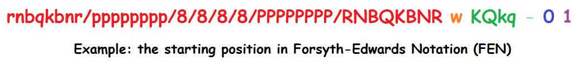
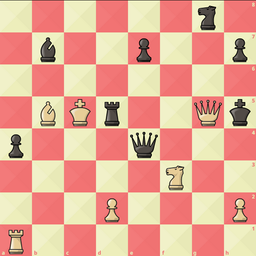
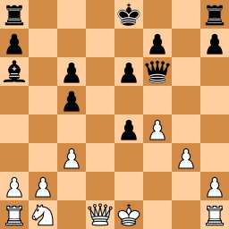

# ♟ chess2fen-ai ♟

Forsyth–Edwards Notation (FEN) is a representation of an instance in a chess game. It allows you to represent the board state (red), the color-to-make-a-move (orange), the castling availability (green), the en passant option (light blue), the half-move clock (blue) and the full-move clock (purple).



In this project, we aim to calculate the FEN-string of an `NxN` image of a digital chess board.

## Example

Using image `/examples/input.png`:



We compute the FEN-string with `python3 main.py -i ../examples/input.png`.

The result of this is `6n1/1b2p2p/8/1BKr2Qk/p3q3/5N2/3P3P/R7 b - - ? 33`, which can be converted into the following image:



## Models and Computations

All models are developed with TensorFlow and Keras, see [card.md](card.md) for more information.

## Evaluation

The model can be humbly tested with `python3 evaluate.py`, which will read FEN-strings from the preloaded `lichess_game_data_test.txt` file, convert them to images, and compare the predicted FEN-strings to the original. Use `-n` to set the size of the test.

Example run:

```
Evaluated 1024 examples
'Board' accuracy: 1.000
'Active color' accuracy: 0.550
'Castling availability' accuracy: 0.996
'En passant' accuracy: 0.999
'Full move clock' count accuracy: 0.000
'Full move clock' offset accuracy: 0.352
```

## Drawbacks

  * Since the program assumes that the board has already been cropped to an `NxN` image of only the board, "excess stuff" will cause problems.
  * The model can struggle a little bit when being provided with images using piece styles other than the provided in `/styles`.
  * Castling availability is naïvely computed (i.e. it is considered valid as long as the pieces are in their original squares).
  * En passant is always assumed to not be possible.
  * No support for the half-move clock yet.

## Getting images of chess boards

The approach I use is to go to [https://lichess.org/editor](https://lichess.org/editor) and insert the desired FEN-string. From there, select the desired piece style and theme. Then in Firefox, right-click on the page, and select `Take Screenshot`. Hover over the board element and select it. This will give a perfect `NxN` image of the chess board.

## Downloading Lichess game data

Visit [https://database.lichess.org/](https://database.lichess.org/) and download the `.pgn.zst` of choice. Then, simply replace the empty file `lichess_game_data.pgn.zst` in `/lichess` with the new file using the same name.

I used January 2015, but any other should work equally well.

To train the models using your downloaded data, start by preloading the data using `preload_lichess_data.py`. This will generate `lichess_game_data_train.txt` and `lichess_game_data_test.txt`, containing one million randomly selected FEN-strings each.

## Using the container

With Docker started, run `docker compose run --rm app` to start a container. The project files are mounted to your local files, so any changes made will be reflected in the container (e.g. updated code) and vice versa (e.g. saved models).
