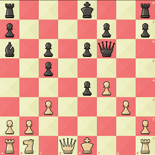

# ♟ chess2fen-ai ♟

Calculate the FEN-string of an `NxN` image of a chess board.

The image will be scaled to the size `256x256`, grayscaled and naïvely divided into an `8x8` grid of `32x32` size images (i.e. one image per square in the board). The piece in each square will be determined by the model, and when each square has been determined, a FEN-string will be computed.

## Example

Using image `/examples/input.png`:



We can run the model with `python3 main.py -i ../examples/input.png`.

The model will predict the following FEN-string: `6n1/1b2p2p/8/1BKr2Qk/p3q3/5N2/3P3P/R7`

Which can be converted into the following image:


## Getting images of chess boards

The approach I use is to go to [https://lichess.org/editor](https://lichess.org/editor) and insert the desired FEN-string. From there, select the desired piece style and theme. Then in Firefox, right-click on the page, and select `Take Screenshot`. Hover over the board element and select it. This will give a perfect `NxN` image of the chess board.

## Model

Expects a `32x32`, normalized and grayscaled image of square from a chess board, and will predict the label corresponding to the content of the square (i.e. either a piece or empty). The output is a one-hot encoded array corresponding to the 13 classes (six types of pieces of two possible colors, and the empty square).

The developed model is a Convolutional Neural Network, with the following layers:

```
_________________________________________________________________
 Layer (type)                 Output Shape             Param #
=================================================================
 input_1 (InputLayer)         [(None, 32, 32, 1)]      0

 conv2d (Conv2D)              (None, 30, 30, 32)       320

 max_pooling2d (MaxPooling2D) (None, 15, 15, 32)       0

 conv2d_1 (Conv2D)            (None, 13, 13, 64)       18496

 flatten (Flatten)            (None, 10816)            0

 dense (Dense)                (None, 64)               692288

 dense_1 (Dense)              (None, 13)               845

=================================================================
Total params: 711,949
Trainable params: 711,949
Non-trainable params: 0
_________________________________________________________________
```

## Training

The model can be trained by running `python3 train.py`. The data for the model will be automatically generated.

### Data generation

I have captured a `256x256` PNG-image of each piece style available in Lichess (with some exceptions), with the default theme, using the FEN-string `kkKKqqQQ/rrRRbbBB/nnNNppPP/8/8/8/8/8`. These are available in `/styles`.

For each image, we apply a handful of filters to create new images (e.g. applying a green mask, thus creating a greener chess board image).

These are then grayscaled, normalized and divided into `8x8` grids. Each image in the grid is given a label of which piece it is in accordance to the FEN-string.

## Using the model

The model can be used with `python3 main.py`, where you have three options:
  * Provide the command line argument `-i` with path to an image, e.g. `-i /examples/input.png`.
  * Provide the command line argument `-f` with a valid FEN-string, e.g. `-f rnbqkbnr/pppppppp/8/8/8/8/PPPPPPPP/RNBQKBNR`. The program will then generate an image for you.
  * Provide no command line argument, in which case the program will randomize a FEN-string.

## Testing the model

The model can be humbly tested with `python3 test.py`, which will automatically generate `100` FEN-strings, convert them to images and compare the model's predictions of the images to the generated strings. (The optional command line argument `-n` can be used to set the desired amount of randomized strings).

Example run:

```
Generating 100 cases...
Predicting...
1/1 [==============================] - 1s 1s/step
100 ✓, 0 X
```

## Drawbacks
  * Since the program assumes that the board has already been cropped to an `NxN` image of only the board, "excess stuff" will cause problems.
  * The model can struggle a little bit when being provided with images using piece styles other than the provided in `/styles`.
